# v6 引擎纠错、迁移与执行政策方案

## 1. 总体架构

v6 采用“规范领域对象 + 纯函数阶段 + 事件账本”的新包，不继续从旧 workflow 导入下划线私有函数。

```mermaid
flowchart LR
    A[Data snapshot + as-of schema] --> B[Calendar / mapping]
    B --> C[Panama point series]
    C --> D[Forecast]
    D --> E[Sector selection]
    E --> F[Risk sizing]
    F --> G[Internal sleeve targets]
    G --> H[Contract-level net target]
    H --> I[Portfolio constraints + buffer]
    I --> J[Order intents]
    J --> K[Execution policy]
    K --> L[Fills / rejects / partials]
    L --> M[Ledger / margin / equity]
    M --> N[Audit / analytics / Chinese reports]
```



建议模块：

```text
src/five_sector_momentum/v6/
  contracts.py
  calendar.py
  data_snapshot.py
  continuous.py
  forecast.py
  selection.py
  risk.py
  target_netting.py
  orders.py
  execution.py
  fee_schedule.py
  margin_schedule.py
  limit_schedule.py
  ledger.py
  audit.py
  analytics.py
  reporting.py
  workflow.py
  adapters/legacy_v3.py
  adapters/legacy_v4_2.py
```

所有模块通过公开类型交互；禁止 `import *`，禁止直接修改其他版本模块的全局状态。

任何影响排名、并列、订单优先级、事件序号或哈希的集合都必须先按注册键稳定排序；不得依赖 Python `set`、未排序 `dict`、进程哈希盐或 DataFrame 当前行序。B07/B08 与 I01/I02 将使用不同 `PYTHONHASHSEED` 验证这一点。

## 2. 两种运行模式

### 2.1 `compatibility` 模式

仅用于证明 v6 适配层能复现旧结果。它显式启用旧费率、旧静态保证金、旧限价缺失等历史行为，并在所有输出加 `KNOWN_DEFECT_COMPATIBILITY_ONLY=true`。该模式的收益不得出现在 v6 正式排名。

### 2.2 `corrected` 模式

使用 v6 数据契约、正确费率、因果限价、方向性逐日保证金和新事件账本。正式研究只能在此模式运行。

两种模式不能靠隐式代码分支猜测，必须在解析后配置和 manifest 中明确。

## 3. 手续费引擎

### 3.1 规则对象

每条 `FeeRule` 至少包含：

```text
rule_id, priority, exchange, instrument/contract_scope, effective_from, effective_to,
trade_type, fee_per_lot, fee_rate_decimal, raw_field, raw_unit,
customer_multiplier, source_url_or_file, is_proxy, proxy_reason
```

成交手续费：

```text
exchange_fee = abs(lots) * fee_per_lot
             + abs(lots) * fill_price * multiplier * fee_rate_decimal
customer_fee = exchange_fee * customer_multiplier
```

固定费与比例费是否同时存在由规则明确，不能默认二选一或取 `max`。

### 3.2 交易类型

- 开仓：`OPEN`；
- 平昨：`CLOSE_YESTERDAY`；
- 平今：`CLOSE_TODAY`；
- 跨零反手：先按原持仓拆出平仓，再对剩余数量开仓；
- 换月：旧合约平仓和新合约开仓为两个真实成交，各自收费；
- 部分成交：只对实际成交量收费；
- 拒单/未成交/内部目标：不收费。

持仓必须按交易日批次保存，才能正确识别平今。即使当前周度策略很少触发平今，也必须覆盖该状态。

平仓分配政策固定为 oldest-lot-first：SHFE/INE 订单显式先 `CLOSE_YESTERDAY`、余额再 `CLOSE_TODAY`；DCE/CZCE/CFFEX/GFEX 的模拟账本同样先分配昨仓再分配今仓。该选择用于复现既有路径，不声称适合所有经纪通道；G0 数据可行性必须对照各交易所规则，若不合法则在任何业绩产生前停止并修订注册。

## 4. 滑点和市场冲击

正式基准继承 v3 的结构：

```text
requested_ticks = base_ticks + roll_extra_ticks + impact_ticks
unclipped_price = adverse_grid(open_price, side, requested_ticks, tick_size)
fill_price = apply_exchange_limit(unclipped_price)
executed_ticks = abs(fill_price - open_price) / tick_size
```

约束：

- 所有 tick 为整数；
- 成交价位于交易所价格网格；
- 基础滑点、换月额外滑点、参与率冲击均记录 requested 贡献；
- 限价截断时记录 `requested_ticks,executed_ticks,limit_clip_ticks`；开盘价不在网格时的独立差额固定记入 `grid_rounding_ticks`，不留“建议归属”；
- 金额恒等式固定为 `executed_slippage = requested_base + requested_roll + requested_impact + grid_rounding - limit_clip_reduction`；
- 滑点只通过成交价进入毛盈亏一次，不再作为现金费用扣减；
- 固定 3 tick 仍作为预注册压力情景，不据结果增加其他点位；
- 报告明确三部分可能重叠，日线数据无法辨认盘口价差、排队和冲击的真实分解。

## 5. 涨跌停与可成交状态机

### 5.1 正式默认政策 `L0_REJECT_RECALCULATE`

这里的执行日开盘是供应商日线 `open` 对应的该交易日首个交易 session；夜盘品种可能发生在前一民事日晚间。该 session 开盘前必须已知官方上下限。所有价格先换算成整数价位 `price_ticks=round(price/tick_size)`，以整数相等判断触及限价，禁止浮点近似阈值。开盘后：

- BUY 且开盘价位于上限：视为逆向不可成交，拒单；
- SELL 且开盘价位于下限：视为逆向不可成交，拒单；
- 上限价时 SELL、下限价时 BUY 属价格侧可成交方向；无论是减仓还是新增风险，都仍需通过成交量、风险、保证金和目标检查后才能执行；“风险降低”不能覆盖错误的价格方向；
- 逆向限价订单的唯一终态是 `REJECTED_LIMIT`，不再对同一剩余量重复记 `CANCELLED`；下一交易日创建一张基于最新目标的新订单，不盲目沿用旧数量；
- 这是保守的“开盘限价无流动性”模型，不得称为逐笔真实排队结果。

当日 `high/low` 可以在事后诊断是否整日一字，但不能用来把未知时刻的成交回填到开盘。

### 5.2 跨零订单

反手订单拆成：

1. 平掉旧方向；
2. 只有已完成的平仓量允许触发对应比例的新开仓；
3. 平仓拒绝时不得开出额外反向仓位；
4. 每腿分别记录订单、成交、拒单、费用和原因。

### 5.3 换月订单

采用 `close_first_matched_roll`：

- 旧腿是前置条件；旧腿未成交时，新腿不得先完整开仓；
- 旧腿部分成交时，新腿最多开出风险匹配的对应数量；
- 两腿都成交才形成完整换月，并各收一次真实费用；
- 旧腿锁板时记录保留敞口和错过的新腿目标；
- 禁止事后删除旧腿成交来模拟拒单。

## 6. 锁板执行政策研究

交接文档中的顺延/次优处理保留为两个独立研究场景，不能并入修复基线。

### `L1_DEFER_SELL`

- RB/T/AL 发生逆向限价：原订单最多顺延一个交易日；第二次仍不可成交则到期并重算；
- 农产品/化工能源：在 t 日收盘时预先保存主选和唯一 runner-up；t+1 主选逆向限价时激活 runner-up 条件单；
- SELL 侧逆向限价：顺延一个交易日。

### `L2_REJECT_SELL`

买入侧同 L1；SELL 侧逆向限价直接拒单并于下一日重算，不保留原订单。

共同规则：

- runner-up 只从 t 日同板块 eligible 且排除主选后的集合产生；多头排序键固定为 `(forecast 降序, instrument_id 升序, ts_code 升序)`，空头固定为 `(forecast 升序, instrument_id 升序, ts_code 升序)`，且必须满足相应正/负号；
- runner-up 的排名、资格、方向、波动率和数量均由 t 日及以前数据生成；按被拒主选腿尚未成交的固定风险预算，使用 runner-up 自身截至 t 的 robust 点差波动率和合约乘数，调用与主选完全相同的整数手 sizing 函数；不得直接复制主选手数；
- t+1 不重新看排名，只检查预生成条件和当日可成交性；
- 无 runner-up 或 runner-up 同样不可成交时，风险预算保持未使用；
- 不允许连续替换第三、第四名；
- 部分成交后只替代未成交风险，不得双重占用预算；
- 换月旧腿不能换品种，只能按换月状态机处理；
- 两个政策场景之外不新增重试天数或替代层级。

## 7. 逐日方向性保证金

### 7.1 取值

- 多头使用 `long_margin_rate`；
- 空头使用 `short_margin_rate`；
- 反手前后按两侧分别计算；
- 预交易约束率使用执行时刻之前已经生效并发布的最近规则；不得使用执行日收盘后才发布的 margin row；
- 客户代理率为交易所率×1.25，并带 `is_proxy=true`；
- 缺失才使用 v3 静态代理回退，不能用 `max(reported,fallback)` 永久压高已报告值，也不能把静态代理视为特殊提保日的风险下界。

### 7.2 约束顺序

1. 先允许价格侧可成交的平仓和风险降低订单；
2. 对新增风险使用拟成交价/实际成交价和开盘前有效保证金率计算成交后预交易保证金；
3. 商品受商品保证金上限；
4. T 不纳入商品保证金上限，保持 v3 的国债处理，但仍计算账户占用、杠杆和资金充足性；
5. 若资金不足，只按整数手缩小开仓，不缩小平仓；
6. 记录约束前目标、约束后目标、缩减原因和未使用风险。

保证金是约束和占用，不是交易成本，不得从权益中扣除。

预交易与日终必须分表：`pretrade_margin_check` 使用开盘前有效率和拟成交价/实际成交价；`eod_margin_snapshot` 使用当日结算价及日终有效率。日终信息不能反向决定当日开盘订单。夜盘成交按交易所定义的下一交易日键归属。

### 7.3 目标约束、日终超限与权益耗尽

商品保证金占权益 65% 和总保证金占权益 78% 沿用 v3 的含义：它们只约束形成下一次真实订单前的目标仓位，不是交易所或期货公司的盘中强平线。预交易目标超过任一上限时，使用既有整数手缩量流程并记 `MARGIN_TARGET_REDUCTION`；平仓和其他纯降险订单不因保证金不足而被阻止。

隔夜价格、结算价、权益或保证金率变化可能令日终实际占用超过 65%/78%。此时只增加 `actual_commodity_margin_breach` / `actual_total_margin_breach` 诊断，下一可计算目标继续通过标准目标约束降险；不得创建独立的 `MARGIN_CALL_LIQUIDATION` 状态，不得假设经纪商能以某一价格立即强平，也不得因此改变 A01—B08 的单因素激活边。

若任一结算点 `equity<=0`，记录 `ACCOUNT_INSOLVENT`，保留截至触发点的订单、成交、持仓、现金、负债和勾稽结果，并立即把场景标为 `FAILED_GATE` 后停止。该 attempt 仍计数；不得继续构造后续成交，不得注入外部资金，不得生成 -100% 后吸收为零的合成有限责任收益曲线，也不得把不完整路径放进 22 策略排名或 Bootstrap。是否建立真实经纪商追保/强平模型需要单独的数据和预注册，明确留给 v6 之后。

为保护单因素阶梯，A01—B08 必须断言 `ACCOUNT_INSOLVENT` 事件数为 0；若出现即触发停止条件，而不是临时启用另一套强平政策。

## 8. 信号、袖套、净额和 buffer

- Panama 收盘价只计算点差 forecast 和点差波动率；
- 每个板块固定 20% 风险预算；
- 20skip5/250 袖套在每板块内各固定 10%，缺失份额不转移；
- 每个内部袖套先形成目标手数并保留 `sleeve_id`；
- 在真实合约层对所有袖套求和，得到唯一净目标；
- 固定阶段顺序为：内部目标→真实合约净额→既有缩放前流动性/OI 预限额→组合协方差统一缩放与实现波动反馈→正常 10% buffer→最终硬约束（再次检查成交量/OI 目标上限、保证金、杠杆）→订单；
- 缩放前预限额在 B01—B08 始终保留；B07/B08 只新增末端复检，因此相对 B05/B06 是一个变化。最终流动性目标上限为 `abs(final_target_lots) <= floor(rolling_median_volume_20*5%)` 且 `<= floor(rolling_median_oi_20*1%)`；它必须在所有可能放大仓位的步骤之后再次执行，约束后不得再有风险放大；
- buffer 只作用一次，但不能阻止硬约束目标降险、清仓、换月和 120% 紧急减仓；这些降险路径绕过 buffer，但不等同经纪商强平；
- 只有最终净订单进入成交和成本引擎；
- 相关性不改变相对板块/袖套风险预算；历史协方差只允许产生全组合统一缩放系数。

## 9. 账户事件模型

建议采用不可变事件：

```text
SignalEvent
SelectionEvent
TargetEvent
NetTargetEvent
OrderCreated
OrderRejected / OrderPartiallyFilled / OrderFilled / OrderExpired
SettlementEvent
FeeCharged
MarginSnapshot
MarginCallEvent
ForcedLiquidationOrder
AccountInsolventEvent
```

每个事件有唯一 ID、父事件 ID、策略/袖套/品种/真实合约、创建时间、有效时间和原因码。报告由事件重放生成，不能依赖流程对象上的可变临时字段。

## 10. 迁移顺序

1. 建 v6 schema、配置解析和只读旧版 adapter；
2. 在完整历史运行前做手续费单位、限价来源、保证金覆盖和共享市场哈希的可行性预检；
3. 实现 compatibility 模式，通过旧结果复现和独立日历桥接；
4. 建完规范数据/规则覆盖闸门后，替换手续费模块并做冻结路径和动态差分；
5. 接入限价、拒单和订单状态机；
6. 接入逐日方向性保证金；
7. 建新账本并独立复算；
8. 接入固定三种信号/袖套；
9. 运行预注册政策和统计实验；
10. 生成报告、manifest 和待人工晋升的 canonical 候选。

每一步只引入一个逻辑变化。若相邻阶梯同时发生未预期的信号漂移，停止而不是继续。
